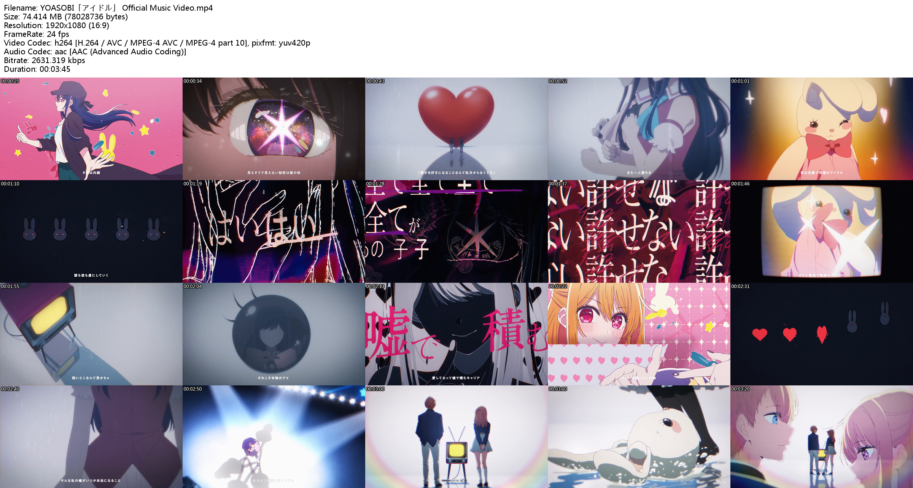

# go-video-thumb

[go-video-thumb](https://github.com/kmou424/go-video-thumb) is a tool that generates a grid of thumbnail images for videos.

## Requirements

- ffmpeg

## Previews

**Default:**



**Custom (`-no-header -cols 6 -rows 6`):**


## Usage

```bash
$ video-thumb -i video.mp4
```

It also supports the drag gesture on Windows. You can drag a video onto the `video-thumb` executable file.

## Other Arguments

```bash
$ video-thumb -i video.mp4 -cols 6 -rows 6 -no-header -font-size 24
```

- `-cols`: Sets the number of columns in the grid of thumbnail images.
- `-rows`: Sets the number of rows in the grid of thumbnail images.
- `-no-header`: Hides the basic information of the video, which is normally inserted at the top of the image.
- `-font-size`: Sets the font size for the text (only available for basic information).

## License

[MIT License](LICENSE)